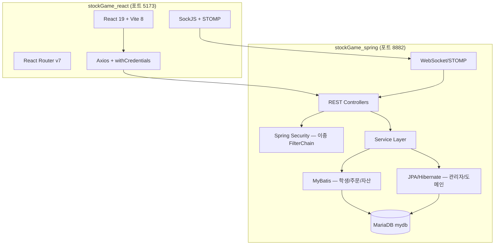
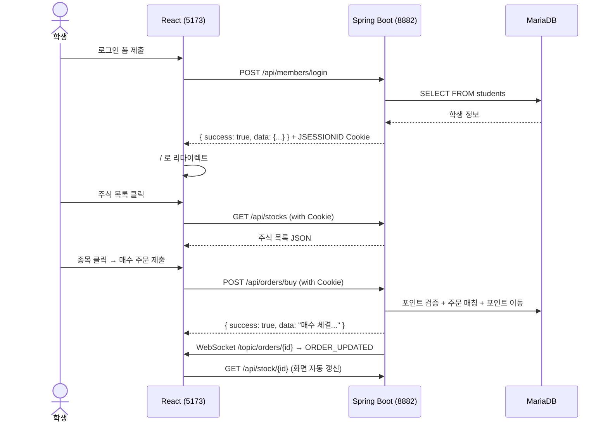

# 📊 프로젝트 종합 분석 보고서

> 분석 일시: 2026-06-29  
> 대상: `stockGame_spring` (백엔드) + `stockGame_react` (프론트엔드)

---

## 1. 아키텍처 개요



---

## 2. stockGame_spring 백엔드 분석

### 2-1. 패키지 구조

| 패키지 | 역할 | 파일 수 |
|---|---|---|
| `controller/` | REST API 엔드포인트 | 9개 컨트롤러 + dto/ |
| `controller/dto/request/` | 요청 DTO | 3개 |
| `controller/dto/response/` | 응답 DTO | 8개 |
| `domain/` | JPA 엔티티 + Enum | 14개 |
| `service/` | 비즈니스 로직 인터페이스 | 9개 |
| `service/impl/` | 비즈니스 로직 구현체 | 8개 |
| `repository/` | JPA Repository + MyBatis | 10개 |
| `config/` | 설정 클래스 | 4개 |
| `auth/` | Spring Security UserDetails | 2개 |
| `exception/` | 커스텀 예외 + 전역 핸들러 | 10개 |
| `resources/mappers/` | MyBatis XML | 8개 |

### 2-2. API 엔드포인트 목록

| 컨트롤러 | 메서드 | 경로 | 설명 |
|---|---|---|---|
| `MemberController` | POST | `/api/members/join` | 회원가입 |
| | POST | `/api/members/login` | 로그인 (HttpSession) |
| | POST | `/api/members/logout` | 로그아웃 |
| | GET | `/api/members/id-check` | 아이디 중복 확인 |
| | GET | `/api/members/me` | 내 정보 조회 |
| `StockDetailController` | GET | `/api/stocks` | 전체 주식 목록 |
| | GET | `/api/stock/{stockId}` | 종목 상세 |
| | GET | `/api/stock/{stockId}/history` | 가격 히스토리 |
| | GET | `/api/stock/{stockId}/orders` | 호가창 |
| `StockOrderController` | POST | `/api/orders/buy` | 매수 |
| | POST | `/api/orders/sell` | 매도 |
| | POST | `/api/orders/cancel` | 주문 취소 |
| `MyAssetController` | GET | `/api/asset` | 내 자산 조회 |
| `MyPointHistoryController` | GET | `/api/history` | 포인트 내역 |
| `CouponController` | GET | `/api/coupons` | 쿠폰 목록 |
| | POST | `/api/coupons/buy` | 쿠폰 구매 |
| `NewsController` | GET | `/api/news` | 뉴스 목록 |
| `AuthApiController` | POST | `/api/auth/login` | 관리자 로그인 |
| `AdminController` | GET/POST | `/admin/**` | 관리자 화면 |

### 2-3. 도메인 엔티티 현황

| 엔티티 | 테이블 | 기술 | 상태 |
|---|---|---|---|
| `Student` | `students` | JPA | ✅ 정상 |
| `Order` | `orders` | JPA + MyBatis 혼용 | ✅ 정상 |
| `Stock` | `stocks` | JPA | ✅ 정상 |
| `Coupon` | `coupons` | JPA | ✅ 정상 |
| `CouponPurchase` | `coupon_purchases` | JPA | ✅ 정상 |
| `News` | `news` | JPA | ✅ 정상 |
| `Transaction` | `transaction` | JPA | ⚠️ amount/price 필드 없음 |
| `StockPriceHistory` | `stock_price_history` | JPA | ✅ 정상 |
| `AppUser` | `app_users` | JPA | ✅ 관리자 전용 |
| `MarketSettings` | `market_settings` | JPA | ✅ 정상 |
| `GetPoint` | `get_point` | MyBatis only | 조회 전용 |

### 2-4. Spring Security 구조

```
Chain 1 (@Order(1)): /admin/**
  → MANAGER/ADMIN 권한 필요 (app_users 테이블)
  → FormLogin + BCrypt 인증
  → CSRF 토큰 활성화

Chain 2 (@Order(2)): 나머지 모든 경로
  → 전체 permitAll (학생 인증은 컨트롤러 레벨 HttpSession으로 처리)
  → CSRF 비활성화
```

### 2-5. 데이터 레이어 혼용 구조 (JPA + MyBatis Hybrid)

| MyBatis (복잡한 조인/쿼리) | JPA (단순 저장/조회) |
|---|---|
| memberMapper.xml | AppUserRepository |
| myAssetMapper.xml | MarketSettingsRepository |
| stockDetailMapper.xml | NewsRepository |
| myPointHistoryMapper.xml | CouponRepository |
| couponMapper.xml | StockPriceHistoryRepository |
| newsMapper.xml | OrderRepository (JPA도 병행) |
| stockPriceHistoryMapper.xml | |

> [!NOTE]
> MyBatis로 복잡한 조인 쿼리를 처리하고, JPA로 단순한 엔티티 저장을 담당하는 하이브리드 구조입니다.

---

## 3. stockGame_react 프론트엔드 분석

### 3-1. 프로젝트 구조

```
src/
├── App.jsx                  # 라우팅 정의 (BrowserRouter)
├── main.jsx                 # React 앱 진입점
├── App.css / index.css      # 전역 스타일
├── api/
│   └── axiosConfig.js       # Axios 인스턴스 + 401 인터셉터
├── components/
│   └── layout/
│       ├── MainLayout.jsx   # 공통 레이아웃 (Sidebar + Outlet)
│       └── Sidebar.jsx      # 우측 사이드바 (유저 정보 + 내비게이션)
└── pages/
    ├── auth/
    │   ├── Login.jsx        # 로그인 폼 + API 연동
    │   └── Register.jsx     # 회원가입 폼 + 아이디 중복체크
    ├── dashboard/
    │   └── Dashboard.jsx    # 내 자산 현황
    ├── stock/
    │   ├── StockList.jsx    # 주식 목록 (테이블)
    │   └── StockDetail.jsx  # 종목 상세 + 차트 + 매수/매도 폼
    ├── news/
    │   └── NewsList.jsx     # 뉴스 목록
    ├── points/
    │   └── PointsHistory.jsx # 포인트 내역
    └── coupons/
        └── CouponStore.jsx  # 쿠폰 상점
```

### 3-2. 라우팅 구조

| 경로 | 컴포넌트 | 레이아웃 |
|---|---|---|
| `/login` | `Login.jsx` | 단독 (Sidebar 없음) |
| `/register` | `Register.jsx` | 단독 |
| `/` | `Dashboard.jsx` | MainLayout (Sidebar 포함) |
| `/stocks` | `StockList.jsx` | MainLayout |
| `/stocks/:stockId` | `StockDetail.jsx` | MainLayout |
| `/news` | `NewsList.jsx` | MainLayout |
| `/points` | `PointsHistory.jsx` | MainLayout |
| `/coupons` | `CouponStore.jsx` | MainLayout |

### 3-3. 의존성 목록

| 패키지 | 버전 | 용도 |
|---|---|---|
| `react` | ^19.2.7 | 코어 |
| `react-dom` | ^19.2.7 | DOM 렌더링 |
| `react-router-dom` | ^7.18.0 | SPA 라우팅 |
| `axios` | ^1.18.1 | HTTP 클라이언트 |
| `apexcharts` | ^5.15.2 | 차트 라이브러리 |
| `react-apexcharts` | ^2.1.1 | React 차트 래퍼 |
| `@stomp/stompjs` | ^7.3.0 | WebSocket STOMP |
| `sockjs-client` | ^1.6.1 | WebSocket 폴백 |

### 3-4. 프론트엔드 ↔ 백엔드 API 연동 현황

| 화면 | API 호출 | 연동 상태 |
|---|---|---|
| **로그인** | `POST /api/members/login` | ✅ 완료 |
| **회원가입** | `POST /api/members/join`, `GET /api/members/id-check` | ✅ 완료 |
| **사이드바** | `GET /api/members/me` | ✅ 완료 |
| **대시보드** | `GET /api/asset` | ✅ 완료 |
| **주식 목록** | `GET /api/stocks` | ✅ 완료 |
| **주식 상세** | `GET /api/stock/{id}`, `GET /api/stock/{id}/history` | ✅ 완료 |
| **매수/매도** | `POST /api/orders/buy`, `POST /api/orders/sell` | ✅ 완료 |
| **WebSocket** | `/ws` → `/topic/orders/{id}`, `/user/queue/notifications` | ✅ 기본 구현 |
| **뉴스** | `GET /api/news` | ✅ 완료 |
| **포인트 내역** | `GET /api/history` | ✅ 완료 |
| **쿠폰 상점** | `GET /api/coupons`, `POST /api/coupons/buy` | ✅ 완료 |
| **호가창 UI** | `GET /api/stock/{id}/orders` | ❌ API 있음, UI 미구현 |

---

## 4. 발견된 이슈 및 개선 필요 사항

### 🔴 Critical (즉시 수정 필요)

#### ① `ddl-auto: create` 운영 사용 금지
- **파일**: `src/main/resources/application.yaml`
- **문제**: 현재 `create` 설정으로 서버 재시작 시 **모든 테이블이 DROP 후 재생성**되어 데이터 유실 위험.
- **해결**: 초기 세팅 완료 후 `none` 또는 `validate`로 변경 필요.

```yaml
# 변경 전
ddl-auto: create

# 변경 후 (운영)
ddl-auto: none
```

#### ② `vite.config.js` Proxy 미설정
- **파일**: `stockGame_react/vite.config.js`
- **문제**: `axiosConfig.js`에 `baseURL: 'http://localhost:8882'` 하드코딩. 배포 환경에서 URL 변경 필요.
- **해결**: Vite proxy 설정 추가 권장.

```js
// vite.config.js 개선안
server: {
  proxy: {
    '/api': 'http://localhost:8882',
    '/ws': { target: 'ws://localhost:8882', ws: true }
  }
}
```

### 🟡 Warning (주의 필요)

#### ③ WebSocket 연결 누수 위험
- **파일**: `stockGame_react/src/pages/stock/StockDetail.jsx`
- **문제**: `useEffect` cleanup에서 `stompClient.deactivate()` 미호출 → 페이지 이동 후에도 연결 유지.
- **해결**: `useRef`로 클라이언트 참조 관리 후 cleanup 시 `deactivate()`.

#### ④ `Transaction` 엔티티 체결 정보 누락
- **파일**: `src/main/java/.../domain/Transaction.java`
- **문제**: `buyOrderNo`, `sellOrderNo`, `createdDate`만 있고 **체결 수량/가격 없음** → 부분체결 기록 불완전.
- **해결**: `amount`, `price` 필드 추가 및 MyBatis 쿼리 보완.

#### ⑤ `StockDetail.jsx` 등락률 표시 미완성
- **파일**: `stockGame_react/src/pages/stock/StockDetail.jsx L121`
- **문제**: `priceDiff` 계산 코드는 있으나 UI에 미표시. `averagePrice`를 이전가로 혼용.
- **해결**: `prevPrice` 필드 활용하여 정확한 등락률 표시.

### 🟢 Minor (향후 개선 권장)

| 항목 | 설명 |
|---|---|
| **비밀번호 암호화** | 학생 비밀번호가 평문 저장 (`MemberServiceImpl`). BCrypt 적용 필요. |
| **전역 상태 관리** | 로그인 정보를 매 요청마다 `/api/members/me`로 조회. `Context API` 또는 `Zustand` 도입 권장. |
| **호가창 UI** | `StockDetail.jsx`에 `/api/stock/{id}/orders` 연동 미구현. 백엔드 API는 이미 존재. |
| **에러 UI** | 각 페이지 에러 처리가 `console.error`에만 의존. 사용자 친화적 에러 메시지 필요. |
| **static 폴더 정리** | `stockGame_spring/src/main/resources/static/` 폴더가 빈 상태. 삭제 가능. |

---

## 5. 전체 연동 흐름 요약



---

## 6. 다음 스프린트 추천 작업 우선순위

| 순위 | 작업 | 예상 공수 |
|---|---|---|
| ① | `ddl-auto: create` → `none`으로 변경 | 5분 |
| ② | `vite.config.js` Proxy 설정 추가 | 10분 |
| ③ | `StockDetail.jsx` WebSocket cleanup 처리 | 30분 |
| ④ | `Transaction` 엔티티 `amount`, `price` 필드 추가 | 1시간 |
| ⑤ | 학생 비밀번호 BCrypt 적용 | 1~2시간 |
| ⑥ | 호가창 UI (`/api/stock/{id}/orders`) 연동 | 2~3시간 |
| ⑦ | 전역 상태 관리 (로그인 Context) 도입 | 2~3시간 |
