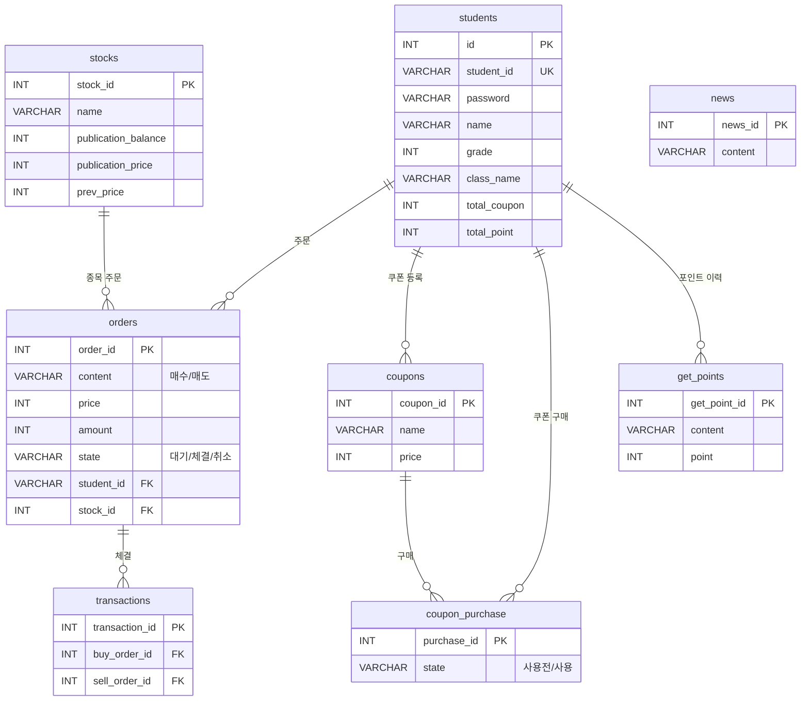

# 📈 stockGame_spring — 프로젝트 요약

> **학생 대상 주식 모의투자 시뮬레이션 게임**의 백엔드 서버 (Spring Boot)

---

## 개요

학교/교육 환경에서 학생들이 **가상 포인트**로 주식을 매매하고, **쿠폰 상점**에서 쿠폰을 구매할 수 있는 모의투자 웹 애플리케이션입니다.  
회원가입 시 **초기 자본 30,000 포인트**가 지급되며, 주식 매수/매도/주문 매칭 엔진을 통해 실제 거래 흐름을 학습할 수 있습니다.

---

## 기술 스택

| 구분 | 기술 |
|---|---|
| **프레임워크** | Spring Boot 3.5.14 (Java 17) |
| **빌드 도구** | Maven |
| **데이터베이스** | MariaDB (localhost:3306 / `mydb`) |
| **데이터 접근** | MyBatis (실제 쿼리) + JPA/Hibernate (DDL 자동생성 전용) |
| **뷰 템플릿** | JSP (13개 페이지) |
| **인증** | HttpSession 기반 수동 세션 관리 |
| **기타** | Lombok, Spring Boot DevTools, Validation |
| **서버 포트** | 8882 |

---

## 데이터베이스 스키마 (8개 테이블)



---

## 아키텍처 구조

```mermaid
graph TD
    subgraph "🖥️ 프론트엔드 (JSP + JS)"
        V1["StockList.jsp<br/>주식 목록"]
        V2["StockDetail.jsp<br/>종목 상세"]
        V3["MyAssets.jsp<br/>내 자산"]
        V4["CouponMarket.jsp<br/>쿠폰 상점"]
        V5["Login.jsp / AddMember.jsp<br/>로그인 / 회원가입"]
    end

    subgraph "🎯 Controller 계층"
        C1["StockOrderController<br/>/orders"]
        C2["StockDetailController<br/>/stock"]
        C3["MyAssetController<br/>/asset"]
        C4["CouponController<br/>/coupons"]
        C5["MemberController<br/>/members"]
        C6["REST APIs<br/>/api/stock, /api/asset"]
    end

    subgraph "⚙️ Service 계층"
        S1["StockOrderService<br/>주문 매칭 엔진 ⭐"]
        S2["StockDetailService"]
        S3["StockPriceService"]
        S4["MyAssetService"]
        S5["CouponService"]
        S6["MemberService"]
        S7["MyPointHistoryService"]
        S8["NewsService"]
    end

    subgraph "💾 Repository 계층 (MyBatis)"
        R1["StockDetailRepository"]
        R2["MyAssetRepository"]
        R3["MemberRepository"]
        R4["CouponRepository"]
        R5["MyPointHistoryRepository"]
        R6["StockListRepository"]
        R7["NewsRepository"]
    end

    V1 & V2 & V3 & V4 & V5 --> C1 & C2 & C3 & C4 & C5 & C6
    C1 & C2 & C3 & C4 & C5 & C6 --> S1 & S2 & S3 & S4 & S5 & S6 & S7 & S8
    S1 & S2 & S3 & S4 & S5 & S6 & S7 & S8 --> R1 & R2 & R3 & R4 & R5 & R6 & R7
```



---

## 핵심 기능

### 1. 📊 주식 매매 (핵심 엔진)

`StockOrderServiceImpl`이 구현하는 **3단계 주문 매칭 로직**:

| 단계 | 설명 |
|---|---|
| **① IPO 매수** | 발행 잔량(`publication_balance`)이 남아있으면 발행가로 즉시 구매 |
| **② P2P 매칭** | 반대 주문(매도↔매수)과 가격이 일치하면 `SELECT ... FOR UPDATE` 비관적 잠금으로 체결 |
| **③ 대기 등록** | 매칭 실패 시 대기 주문으로 등록 → 추후 매칭 대기 |

- 매도: 보유 주식 확인 → 매칭 시도 → 대기 등록
- 주문 취소: 소유 검증 + 상태 확인 후 취소 처리 (매수 취소 시 포인트 환불)
- 모든 거래는 `@Transactional` 트랜잭션 관리

### 2. 👤 회원 관리

| 기능 | 설명 |
|---|---|
| 회원가입 | 학번, 이름, 학년, 반, 비밀번호 입력 → 초기 30,000 포인트 지급 |
| 로그인 | DB 조회 기반 (세션에 `studentId`, `loginOk` 저장) |
| 아이디 중복 체크 | AJAX 기반 실시간 확인 |

### 3. 💰 자산 관리 (대시보드)

- 총 보유 포인트, 쿠폰 수, 종목별 보유 현황
- 종목별 **평균 매입가, 매입 금액, 수익률** 계산
- REST API로 실시간 대시보드 데이터 제공

### 4. 🎫 쿠폰 상점

- 쿠폰 목록 조회 및 포인트로 구매
- 구매 시 포인트 차감 + 쿠폰 개수 증가 + 구매 이력 기록
- 상태 관리: `사용전` → `사용`

### 5. 📰 뉴스 시스템

- 투자 심리 자극을 위한 가상 뉴스 피드

### 6. 📜 포인트 이력

- 쿠폰 구매 / 포인트 지급 / 주식 매수 / 주식 매도 **4개 소스** `UNION ALL` 통합 조회

---

## API 엔드포인트 정리

### MVC (페이지 렌더링)

| 메서드 | 경로 | 설명 |
|---|---|---|
| `GET` | `/members/join` | 회원가입 페이지 |
| `POST` | `/members/join` | 회원가입 처리 |
| `GET` | `/members/login` | 로그인 페이지 |
| `POST` | `/members/login` | 로그인 처리 |
| `GET` | `/members/logout` | 로그아웃 |
| `GET` | `/members/id-check` | 아이디 중복 확인 |
| `GET` | `/stock/{stockId}` | 종목 상세 |
| `POST` | `/orders/buy` | 매수 주문 |
| `POST` | `/orders/sell` | 매도 주문 |
| `POST` | `/orders/cancel` | 주문 취소 |
| `GET` | `/asset/` | 내 자산 페이지 |
| `GET` | `/coupons/` | 쿠폰 상점 |
| `POST` | `/coupons/buy` | 쿠폰 구매 |
| `GET` | `/history` | 포인트 이력 |
| `GET` | `/news/` | 뉴스 목록 |

### REST API (JSON 응답)

| 메서드 | 경로 | 설명 |
|---|---|---|
| `GET` | `/api/asset/dashboard` | 대시보드 데이터 |
| `GET` | `/api/stock/live-orders` | 실시간 호가창 (매수/매도 주문) |
| `GET` | `/api/stock/waiting-orders` | 내 대기 주문 |
| `GET` | `/api/stock/price` | 전체 종목 현재가/변동률 |

---

## 주요 특징 및 참고사항

> [!NOTE]
> **하이브리드 JPA + MyBatis**: JPA `@Entity` 어노테이션은 DDL 자동생성 전용이며, 실제 데이터 접근은 모두 MyBatis 매퍼를 통해 수행됩니다.

> [!WARNING]
> **비밀번호 평문 저장**: 현재 비밀번호가 암호화 없이 저장/비교됩니다. BCrypt 등의 해싱 적용이 필요합니다.

> [!WARNING]
> **Spring Security 미설정**: 의존성은 포함되어 있지만 커스텀 설정이 없어, 수동 HttpSession으로 인증을 처리합니다.

> [!NOTE]
> **한국어 Enum**: `OrderStatus` (대기, 체결, 취소, 매도, 매수)와 `CouponPurchaseStatus` (사용, 사용전)가 한국어로 정의되어 DB에 직접 저장됩니다.

---

## 파일 구조 요약

```
src/main/java/com/skfkfkvlrm/stockgame_spring/
├── controller/              # 10개 컨트롤러 (MVC 7 + REST 3)
│   └── dto/
│       ├── request/         # StockOrderRequest, StudentJoinRequest, StudentLoginRequest
│       └── response/        # 7개 응답 DTO
├── domain/                  # 10개 도메인 클래스 (8 Entity + 2 Enum)
├── repository/              # 7개 MyBatis Mapper 인터페이스
├── service/                 # 8개 서비스 인터페이스
│   └── impl/                # 8개 서비스 구현체
└── StockGameSpringApplication.java

src/main/resources/
├── application.yaml
├── mappers/                 # 7개 MyBatis XML 매퍼
└── templates/
    ├── css/                 # 9개 CSS 파일
    ├── js/                  # 6개 JavaScript 파일
    └── view/                # 13개 JSP 페이지
```
