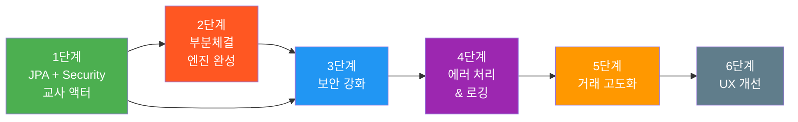
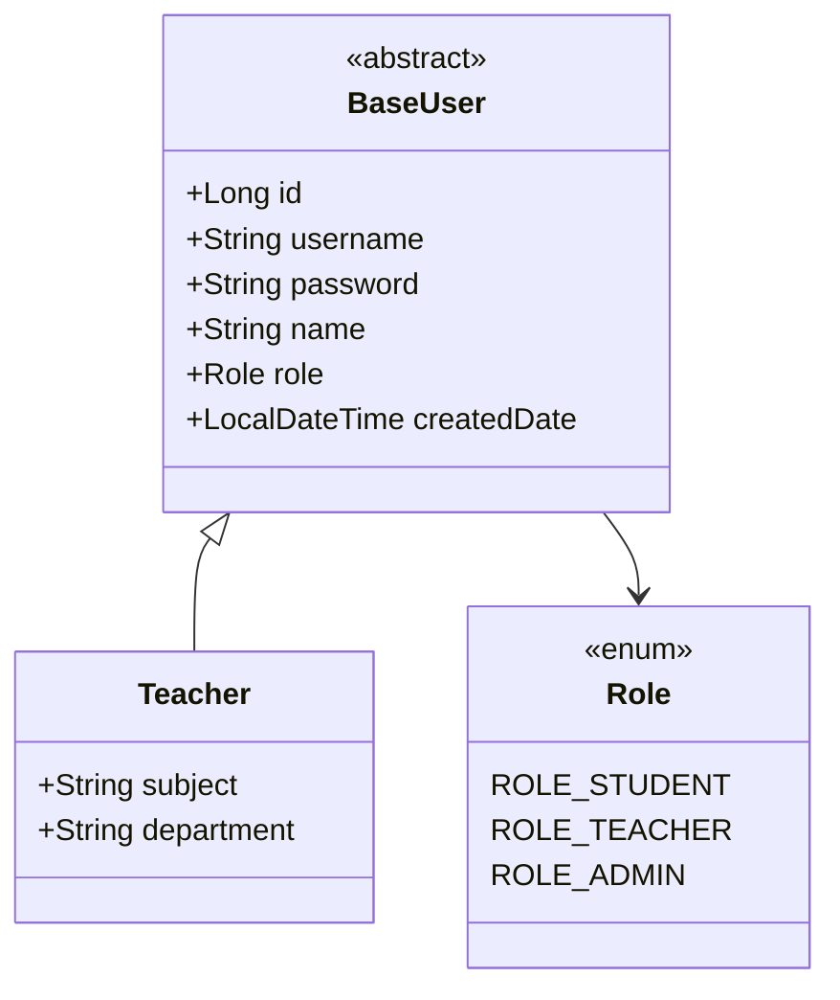
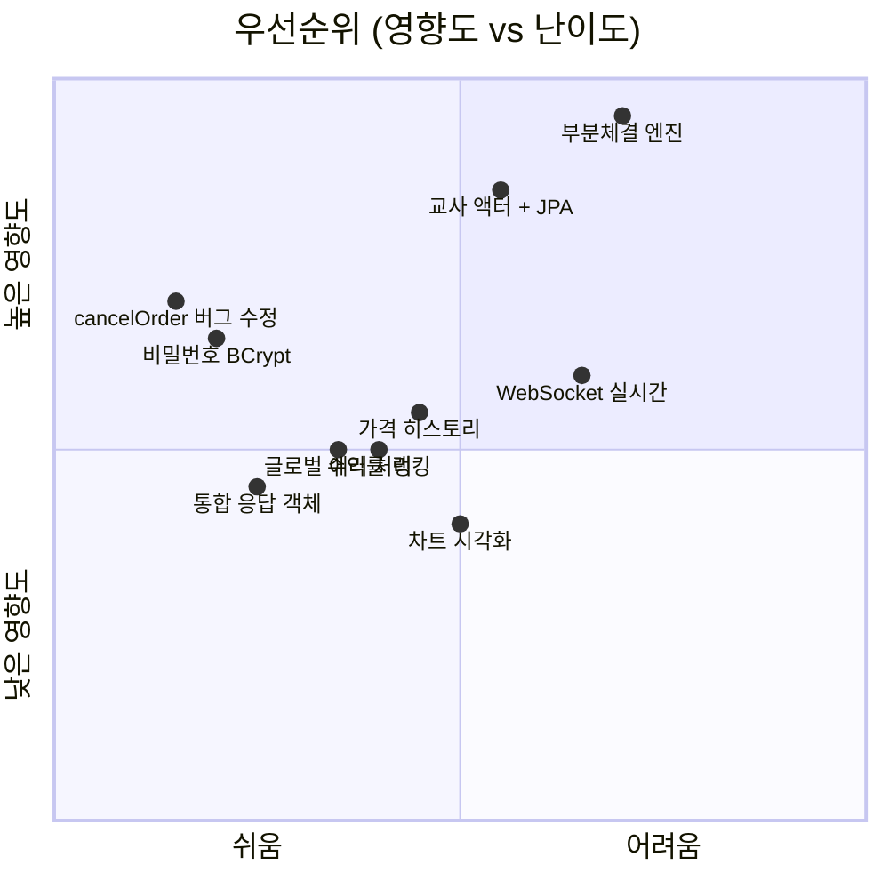

# 📋 stockGame_spring — 종합 개선 제안서

---

## 🔍 현재 코드 분석 결과

### 부분체결 문제 (핵심 이슈)

> [!CAUTION]
> 현재 주문 매칭 엔진은 **수량이 정확히 일치하는 주문만 매칭**합니다. 부분체결이 불가능합니다.

[getMatchOrder](file:///C:/Users/KOSTA/.gemini/antigravity/worktrees/stockGame_spring/add-project-summarization-feature/src/main/resources/mappers/stockDetailMapper.xml#L87-L93) 쿼리를 보면:

```sql
-- 현재: amount가 정확히 같아야만 매칭됨
AND amount = #{orderAmount}
```

| 시나리오 | 현재 동작 | 기대 동작 |
|---|---|---|
| A가 10주 매수, B가 10주 매도 | ✅ 체결 | ✅ 체결 |
| A가 10주 매수, B가 5주 매도 | ❌ 매칭 불가 → 둘 다 대기 | ⭕ 5주 부분체결, A의 나머지 5주 대기 |
| A가 5주 매수, B가 10주 매도 | ❌ 매칭 불가 → 둘 다 대기 | ⭕ 5주 부분체결, B의 나머지 5주 대기 |

추가로 발견된 문제점:

- [cancelOrder](file:///C:/Users/KOSTA/.gemini/antigravity/worktrees/stockGame_spring/add-project-summarization-feature/src/main/java/com/skfkfkvlrm/stockgame_spring/service/impl/StockOrderServiceImpl.java#L145)에서 `"BUY".equals(order.getContent())` 비교 → `OrderStatus` enum은 한국어(`매수`)이므로 **매수 취소 시 포인트 환불이 작동하지 않음**
- `Transaction` 엔티티에 **체결 수량(amount), 체결 가격(price)** 필드가 없어 부분체결 기록 불가
- IPO 매수 시 발행가보다 높은 가격을 지불해도 **차액 환불 없이 전액 차감**

---

## 개선 로드맵



---

## 1단계: JPA + Spring Security + 교사(Teacher) 액터 도입

> [!IMPORTANT]
> **원칙**: 기존 학생 관련 MyBatis는 그대로 유지. JPA는 Security/교사 도메인에만 적용.

### 1-1. 도메인 설계



#### [NEW] `Teacher.java` — JPA 엔티티
```java
@Entity
@Table(name = "teachers")
public class Teacher {
    @Id @GeneratedValue(strategy = IDENTITY)
    private Long id;
    
    @Column(unique = true, nullable = false)
    private String username;        // 교사 로그인 ID
    
    @Column(nullable = false)
    private String password;        // BCrypt 해싱
    
    private String name;
    private String subject;         // 담당 과목
    
    @Enumerated(EnumType.STRING)
    private Role role;              // ROLE_TEACHER
    
    @CreationTimestamp
    private LocalDateTime createdDate;
}
```

#### [NEW] `TeacherRepository.java` — Spring Data JPA
```java
public interface TeacherRepository extends JpaRepository<Teacher, Long> {
    Optional<Teacher> findByUsername(String username);
    boolean existsByUsername(String username);
}
```

### 1-2. Spring Security 설정

#### [NEW] `SecurityConfig.java`
```java
@Configuration
@EnableWebSecurity
public class SecurityConfig {

    @Bean
    public SecurityFilterChain filterChain(HttpSecurity http) throws Exception {
        http
            .authorizeHttpRequests(auth -> auth
                // 교사 전용 관리 페이지
                .requestMatchers("/admin/**").hasRole("TEACHER")
                // 학생 기존 경로는 permitAll (기존 세션 방식 유지)
                .requestMatchers("/members/**", "/stock/**", "/orders/**", 
                                 "/asset/**", "/coupons/**", "/news/**", 
                                 "/api/**", "/history").permitAll()
                .requestMatchers("/css/**", "/js/**").permitAll()
                .anyRequest().authenticated()
            )
            .formLogin(form -> form
                .loginPage("/admin/login")
                .defaultSuccessUrl("/admin/dashboard")
                .permitAll()
            )
            .logout(logout -> logout
                .logoutUrl("/admin/logout")
                .logoutSuccessUrl("/admin/login")
            )
            .csrf(csrf -> csrf.disable()); // 기존 API 호환
        return http.build();
    }

    @Bean
    public PasswordEncoder passwordEncoder() {
        return new BCryptPasswordEncoder();
    }
}
```

> [!NOTE]
> 학생 경로(`/members/**`, `/stock/**` 등)는 `permitAll()`로 열어 **기존 HttpSession 기반 인증을 그대로 유지**합니다. 교사만 Spring Security 인증을 사용합니다.

### 1-3. 교사 기능 (관리자 페이지)

| 기능 | 엔드포인트 | 설명 |
|---|---|---|
| 대시보드 | `GET /admin/dashboard` | 전체 학생 현황, 총 거래량, 종목별 시세 |
| 종목 관리 | `GET/POST /admin/stocks` | 주식 종목 CRUD (신규 상장, 상장 폐지, 발행가 변경) |
| 학생 관리 | `GET /admin/students` | 학생 목록, 포인트 수동 지급/차감 |
| 뉴스 관리 | `GET/POST /admin/news` | 뉴스 CRUD (투자 심리 자극용) |
| 쿠폰 관리 | `GET/POST /admin/coupons` | 쿠폰 CRUD, 쿠폰 사용 승인 |
| 거래 모니터링 | `GET /admin/transactions` | 전체 거래 내역 조회, 비정상 거래 감지 |
| 시장 제어 | `POST /admin/market/pause` | 거래 일시 중지/재개 |

### 1-4. 신규/수정 파일 목록

| 상태 | 파일 | 기술 |
|---|---|---|
| **[NEW]** | `domain/Teacher.java` | JPA 엔티티 |
| **[NEW]** | `domain/Role.java` | Enum (ROLE_STUDENT, ROLE_TEACHER) |
| **[NEW]** | `repository/TeacherRepository.java` | Spring Data JPA |
| **[NEW]** | `config/SecurityConfig.java` | Spring Security 설정 |
| **[NEW]** | `service/TeacherService.java` | 교사 비즈니스 로직 |
| **[NEW]** | `service/CustomUserDetailsService.java` | Security UserDetailsService |
| **[NEW]** | `controller/AdminController.java` | 교사 관리 페이지 MVC |
| **[NEW]** | `controller/AdminApiController.java` | 교사 REST API |
| **[MODIFY]** | `application.yaml` | Security 설정 추가 |
| **[MODIFY]** | `pom.xml` | spring-boot-starter-data-jpa 이미 있음 (OK) |

---

## 2단계: 부분체결(Partial Fill) 엔진 완성

> [!WARNING]
> 현재 가장 큰 기능 결함입니다. 수량 정확히 일치하는 주문만 매칭되므로, 실사용 시 대부분의 주문이 대기 상태로 남게 됩니다.

### 2-1. 매칭 알고리즘 변경

**현재 (All-or-Nothing)**:
```
매수 10주 @ 1000원  ←→  매도 10주 @ 1000원  ✅ (수량 일치만 가능)
매수 10주 @ 1000원  ←→  매도  5주 @ 1000원  ❌ (매칭 불가)
```

**변경 (Partial Fill)**:
```
매수 10주 @ 1000원  ←→  매도 5주 @ 1000원  → 5주 체결 + 매수 잔량 5주 대기
매수 10주 @ 1000원  ←→  매도 3주 + 매도 4주 → 7주 체결 + 매수 잔량 3주 대기
```

### 2-2. 핵심 변경 사항

#### Order 엔티티 — `filledAmount` 필드 추가
```diff
 public class Order {
     private int orderId;
     private OrderStatus content;
     private int price;
     private int amount;          // 원래 주문 수량
+    private int filledAmount;    // 체결된 수량 (0부터 시작)
+    private OrderStatus state;   // 대기 / 부분체결 / 체결 / 취소
     ...
 }
```

#### OrderStatus 확장
```diff
 public enum OrderStatus {
     대기,
     체결,
+    부분체결,   // 일부만 체결됨
     취소,
     매도,
     매수
 }
```

#### Transaction 엔티티 — 체결 수량/가격 추가
```diff
 public class Transaction {
     private int transactionId;
     private int buyOrderNo;
     private int sellOrderNo;
+    private int amount;       // 이번 체결에서 거래된 수량
+    private int price;        // 체결 가격
     private LocalDateTime createdDate;
 }
```

#### DDL 변경
```sql
-- orders 테이블
ALTER TABLE orders ADD COLUMN filled_amount INT DEFAULT 0;

-- transactions 테이블
ALTER TABLE transactions ADD COLUMN amount INT NOT NULL;
ALTER TABLE transactions ADD COLUMN price INT NOT NULL;
```

### 2-3. 새로운 매칭 로직 (의사 코드)

```java
public String buyStock(StockOrderRequest request) {
    int remainAmount = request.getAmount();
    int totalCost = 0;
    
    // 1. IPO 매칭 (발행 잔량이 있을 때)
    if (pubAmount > 0) {
        int fillQty = Math.min(remainAmount, pubAmount);
        // fillQty만큼 발행 매수 처리
        remainAmount -= fillQty;
        totalCost += fillQty * pubPrice;
    }
    
    // 2. P2P 매칭 (가격 ≤ 매수 호가인 매도 대기 주문을 시간순으로)
    List<Order> sellOrders = getMatchableSellOrders(stockId, price);
    for (Order sell : sellOrders) {
        if (remainAmount <= 0) break;
        
        int sellRemain = sell.getAmount() - sell.getFilledAmount();
        int fillQty = Math.min(remainAmount, sellRemain);
        
        // fillQty만큼 부분체결 처리
        sell.setFilledAmount(sell.getFilledAmount() + fillQty);
        if (sell.getFilledAmount() == sell.getAmount()) {
            sell.setState(OrderStatus.체결);     // 완전 체결
        } else {
            sell.setState(OrderStatus.부분체결);  // 부분 체결
        }
        
        // Transaction 기록 (수량/가격 포함)
        createTransaction(buyOrderId, sell.getOrderId(), fillQty, price);
        
        // 포인트 이동
        transferPoints(buyer, seller, fillQty * price);
        
        remainAmount -= fillQty;
        totalCost += fillQty * price;
    }
    
    // 3. 잔량 처리
    if (remainAmount > 0) {
        // 남은 수량은 대기 주문으로 등록
        registerPendingOrder(request, remainAmount);
    }
    
    return buildResultMessage(request.getAmount(), remainAmount);
}
```

### 2-4. getMatchOrder 쿼리 변경

```diff
 -- 기존: 수량 정확히 일치 + 1건만
 SELECT ... FROM orders
 WHERE stock_id = #{stockId} AND state = '대기' AND content = #{content}
-  AND price = #{orderPrice} AND amount = #{orderAmount}
+  AND price = #{orderPrice}
+  AND (amount - filled_amount) > 0
 ORDER BY created_date ASC
-LIMIT 1 FOR UPDATE
+FOR UPDATE
```

### 2-5. cancelOrder 버그 수정

```diff
 // 현재: "BUY"와 비교 → OrderStatus enum은 한국어이므로 항상 false
-if ("BUY".equals(order.getContent())) {
+if (OrderStatus.매수.name().equals(order.getContent())) {
     // 부분체결된 수량 제외하고 남은 수량만 환불
-    int refundAmount = order.getPrice() * order.getAmount();
+    int remainAmount = order.getAmount() - order.getFilledAmount();
+    int refundAmount = order.getPrice() * remainAmount;
     stockDetailRepository.setStudentPointUp(refundAmount, studentId);
 }
```

### 2-6. 수정 파일 목록

| 상태 | 파일 | 변경 내용 |
|---|---|---|
| **[MODIFY]** | `domain/Order.java` | `filledAmount` 필드 추가 |
| **[MODIFY]** | `domain/OrderStatus.java` | `부분체결` 추가 |
| **[MODIFY]** | `domain/Transaction.java` | `amount`, `price` 필드 추가 |
| **[MODIFY]** | `service/impl/StockOrderServiceImpl.java` | 반복 매칭 + 부분체결 로직 전면 개편 |
| **[MODIFY]** | `repository/StockDetailRepository.java` | 쿼리 시그니처 변경 |
| **[MODIFY]** | `mappers/stockDetailMapper.xml` | 매칭 쿼리, 업데이트 쿼리 수정 |
| **[MODIFY]** | `mappers/myAssetMapper.xml` | 보유 수량 계산에 `filled_amount` 반영 |
| **[MODIFY]** | `ddl.txt` | ALTER TABLE 추가 |

---

## 3단계: 보안 강화

| 항목 | 현재 상태 | 개선 방안 | 우선순위 |
|---|---|---|---|
| 비밀번호 저장 | 평문 저장 ([MemberServiceImpl L23](file:///C:/Users/KOSTA/.gemini/antigravity/worktrees/stockGame_spring/add-project-summarization-feature/src/main/java/com/skfkfkvlrm/stockgame_spring/service/impl/MemberServiceImpl.java#L23)) | BCrypt 해싱 적용 | 🔴 높음 |
| 학생 인증 | 수동 HttpSession 체크 | 점진적으로 Spring Security 통합 (2단계 이후) | 🟡 중간 |
| 세션 검증 | `session.setAttribute` → 바로 `getAttribute` 체크 ([StockOrderController L23-24](file:///C:/Users/KOSTA/.gemini/antigravity/worktrees/stockGame_spring/add-project-summarization-feature/src/main/java/com/skfkfkvlrm/stockgame_spring/controller/StockOrderController.java#L23-L24)) | set 전에 검증 or Security 위임 | 🟡 중간 |
| CSRF | `csrf.disable()` | 교사 관리 페이지에는 CSRF 적용 권장 | 🟢 낮음 |
| SQL Injection | MyBatis `#{}` 사용 (OK) | 현재 양호 | ✅ 완료 |

---

## 4단계: 에러 처리 & 응답 구조화

### 현재 문제
- 서비스 계층에서 에러를 `String` 메시지로 반환 → 컨트롤러에서 성공/실패 구분 불가
- 글로벌 예외 처리 없음

### 개선 방안

#### [NEW] 통합 응답 객체
```java
public class ApiResponse<T> {
    private boolean success;
    private String message;
    private T data;
    private String errorCode;
}
```

#### [NEW] 커스텀 예외 + 글로벌 핸들러
```java
// 예외 정의
public class InsufficientPointException extends BusinessException { ... }
public class OrderNotFoundException extends BusinessException { ... }
public class StockNotAvailableException extends BusinessException { ... }

// 글로벌 핸들러
@RestControllerAdvice
public class GlobalExceptionHandler {
    @ExceptionHandler(BusinessException.class)
    public ResponseEntity<ApiResponse<?>> handleBusiness(BusinessException e) { ... }
}
```

---

## 5단계: 거래 기록 고도화

| 기능 | 설명 |
|---|---|
| **가격 히스토리 테이블** | 종목별 시간대별 가격 변동 기록 → 차트 데이터 제공 |
| **일별 종가 저장** | `stock_price_history(stock_id, date, open, high, low, close, volume)` |
| **거래량 집계** | 종목별 일별/시간별 거래량 |
| **수익률 랭킹** | 학생 간 수익률 순위 → 교사 대시보드에서 조회 |
| **prev_price 자동화** | 현재 수동 관리 → 스케줄러로 자동 갱신 (`@Scheduled`) |

---

## 6단계: UX & 추가 기능

| 기능 | 설명 | 비고 |
|---|---|---|
| **실시간 호가창** | WebSocket(STOMP)으로 실시간 주문 반영 | `spring-boot-starter-websocket` |
| **주문 확인 다이얼로그** | 매수/매도 전 "정말 N주를 X원에 매수하시겠습니까?" 확인 | JS 모달 |
| **호가 단위 제한** | 가격대별 호가 단위 (100원 미만 → 1원 단위, 1000원 이상 → 10원 단위) | 실제 증시 모사 |
| **일일 거래 한도** | 학생당 일일 최대 거래 금액/횟수 제한 | 교사가 설정 |
| **시장 영업시간** | 교사가 거래 가능 시간 설정 (예: 수업 시간에만 개장) | 교사 관리 |
| **차트 시각화** | 종목 상세 페이지에 캔들스틱/라인 차트 | Chart.js or Lightweight Charts |
| **알림 시스템** | 체결/부분체결 완료 시 알림 | SSE or WebSocket |

---

## 우선순위 매트릭스



---

## 즉시 수정 가능한 버그 (1-2시간 이내)

> [!WARNING]
> 아래 두 건은 로직 오류로, 우선순위와 무관하게 즉시 수정이 필요합니다.

### 1. cancelOrder 매수 환불 미작동
- **위치**: [StockOrderServiceImpl L145](file:///C:/Users/KOSTA/.gemini/antigravity/worktrees/stockGame_spring/add-project-summarization-feature/src/main/java/com/skfkfkvlrm/stockgame_spring/service/impl/StockOrderServiceImpl.java#L145)
- **원인**: `"BUY".equals(order.getContent())` — enum이 한국어(`매수`)라 항상 `false`
- **영향**: 매수 대기 주문을 취소해도 포인트가 환불되지 않음

### 2. StockOrderController 세션 검증 무의미
- **위치**: [StockOrderController L23-24](file:///C:/Users/KOSTA/.gemini/antigravity/worktrees/stockGame_spring/add-project-summarization-feature/src/main/java/com/skfkfkvlrm/stockgame_spring/controller/StockOrderController.java#L23-L24)
- **원인**: `session.setAttribute("studentId", ...)` 직후 `session.getAttribute("studentId") == null` 체크 → 항상 non-null
- **영향**: 로그인 검증이 사실상 작동하지 않음
