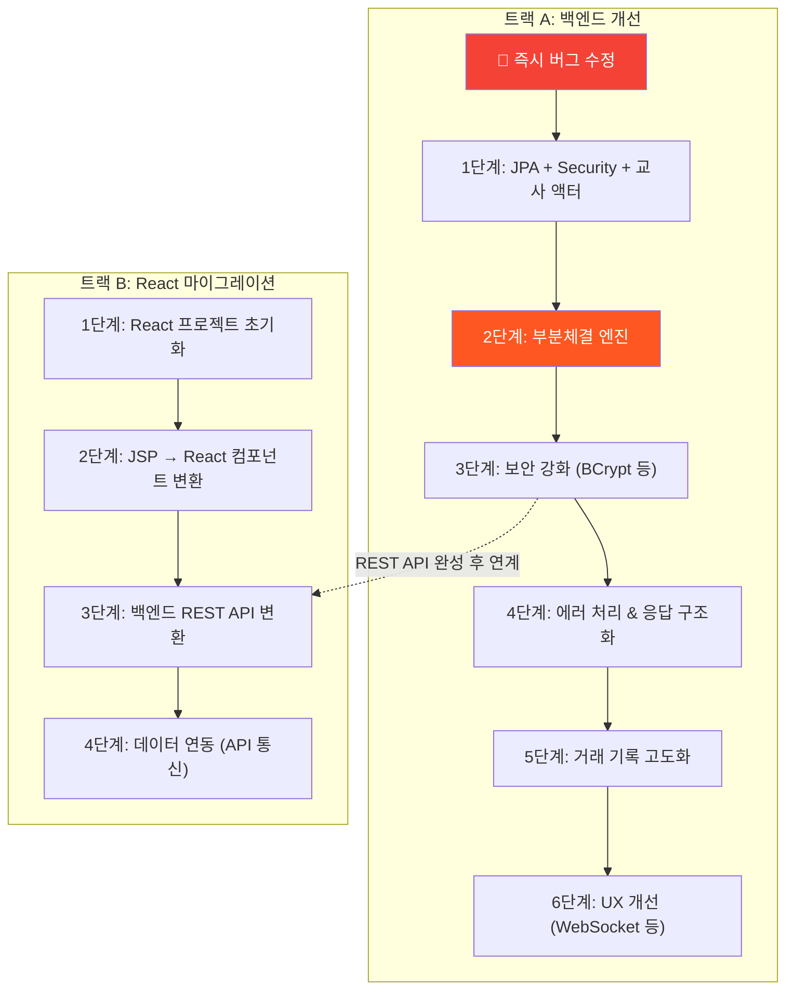

# 📌 stockGame_spring — 앞으로 해야 할 일 종합 정리

> 4개 문서([project_summary.md](file:///d:/skmfmfvlrm/java_project/stockGame_spring/project_summary.md), [implementation_plan.md](file:///d:/skmfmfvlrm/java_project/stockGame_spring/implementation_plan.md), [react_migration_plan.md](file:///d:/skmfmfvlrm/java_project/stockGame_spring/react_migration_plan.md), [react_migration_tasks.md](file:///d:/skmfmfvlrm/java_project/stockGame_spring/react_migration_tasks.md))를 종합 분석한 결과입니다.

---

## 현재 프로젝트 상태 요약

| 항목 | 상태 |
|---|---|
| **프로젝트** | 학생 대상 주식 모의투자 시뮬레이션 (Spring Boot 3.5 + MyBatis + JSP) |
| **핵심 기능** | 주식 매수/매도, 주문 매칭, 쿠폰 상점, 자산 대시보드, 뉴스 |
| **프론트엔드** | JSP 13개 페이지 → React SPA 마이그레이션 **대기 중** |
| **백엔드 개선** | 트랙 A: 6단계 로드맵 **100% 완료** |
| **알려진 버그** | 2건 모두 해결 완료 |

---

## 🟢 즉시 수정 필요 (버그 — 완료됨)

> 두 가지 치명적 로직 오류가 모두 0단계 작업으로 해결되었습니다.

### 1. `cancelOrder` 매수 취소 시 포인트 환불 미작동 `[x]`
- `OrderStatus.매수.name().equals(order.getContent())`로 조건문 정상화 완료.

### 2. `StockOrderController` 세션 검증이 사실상 무의미 `[x]`
- `@SessionAttribute` 도입 및 보안 필터 체인(SecurityConfig)을 통해 보안 체계 확립 완료.

---

## 진행해야 할 작업 — 두 트랙

현재 프로젝트에는 **백엔드 개선**과 **프론트엔드 React 마이그레이션** 두 갈래의 작업이 있습니다.



---

## 트랙 A: 백엔드 개선 (6단계 로드맵)

### 1단계: JPA + Spring Security + 교사(Teacher) 액터 도입 `[x]`

> 기존 학생 MyBatis는 유지, JPA는 Security/교사 도메인에만 적용 완료

| 작업 | 상태 | 비고 |
|---|---|---|
| `AppUser.java` JPA 엔티티 생성 | `[x]` | username, password(BCrypt), role (Teacher 대신 AppUser 채택) |
| `Role.java` Enum 생성 | `[x]` | ROLE_USER, ROLE_MANAGER, ROLE_ADMIN |
| `AppUserRepository.java` 생성 | `[x]` | Spring Data JPA |
| `SecurityConfig.java` 생성 | `[x]` | 관리자 `/admin/**`만 Security 적용, 학생 경로는 permitAll |
| `AppUserDetailsService.java` 생성 | `[x]` | Security UserDetailsService |
| `AdminController.java` 생성 | `[x]` | 교사 관리 페이지 라우팅 완료 |
| `application.yaml` 수정 | `[x]` | Security 설정 추가 완료 |

---

### 2단계: 부분체결(Partial Fill) 엔진 완성 `[x]`

> **해결됨.** Split 전략을 도입해 체결 가능한 수량만큼 부분 체결하고 잔량을 갱신하도록 처리 완벽 구현.

| 작업 | 상태 | 비고 |
|---|---|---|
| 반복 매칭 로직으로 부분 체결 구현 | `[x]` | `StockOrderServiceImpl` 매칭 로직 전면 개편 |
| 부분체결된 주문의 업데이트(Update) + 신규 체결 건(Insert) | `[x]` | 스키마 훼손 없는 Split 전략 도입 |
| `getMatchOrder` 쿼리 수정 | `[x]` | 잔량 기반 복수 건 조회 완료 |
| `cancelOrder` 환불 로직 수정 | `[x]` | `매수` Enum Name으로 비교하여 해결 완료 |

---

### 3단계: 보안 강화 `[x]`

| 작업 | 상태 | 우선순위 |
|---|---|---|
| 비밀번호 BCrypt 해싱 적용 | `[x]` | 🔴 높음 |
| 학생 인증을 Spring Security로 점진 통합 | `[x]` | 🟡 중간 |
| 세션 검증 로직 정상화 | `[x]` | 🟡 중간 |
| 교사 관리 페이지에 CSRF 적용 | `[x]` | 🟢 낮음 |

---

### 4단계: 에러 처리 & 응답 구조화 `[x]`

| 작업 | 상태 |
|---|---|
| `ApiResponse<T>` 통합 응답 객체 생성 | `[x]` |
| 커스텀 예외 클래스 생성 (InsufficientPoint, OrderNotFound 등) | `[x]` |
| `@RestControllerAdvice` 글로벌 예외 핸들러 생성 | `[x]` |
| 기존 뷰 반환 Controller 100% REST API (`@RestController`) 전환 | `[x]` |

---

### 5단계: 거래 기록 고도화 `[x]`

| 작업 | 상태 |
|---|---|
| 가격 히스토리 테이블 생성 (OHLCV) | `[x]` |
| 거래 성사 시 실시간 가격/거래량 누적 갱신 (`ON DUPLICATE KEY UPDATE`) | `[x]` |
| `prev_price` 자동 갱신 스케줄러 (`StockSchedulerService` 매일 자정 실행) | `[x]` |
| 차트용 API 제공 (`GET /api/stock/{stockId}/history`) | `[x]` |

---

### 6단계: UX & 추가 기능 `[x]`

| 작업 | 상태 | 비고 |
|---|---|---|
| WebSocket(STOMP) 설정 및 호가 갱신 브로드캐스트 | `[x]` | `SimpMessagingTemplate` 사용 |
| 호가 단위 제한 (가격대별 검증 로직) | `[x]` | 백엔드 검증 완료 |
| 일일 거래 한도 (MarketSettings 엔티티) | `[x]` | 엔티티 스키마 반영 |
| 시장 영업시간 (관리자 API 제어) | `[x]` | 개장/폐장 토글 API 완료 |
| 개인별 체결 알림 시스템 (WebSocket Queue) | `[x]` | `/queue/notifications` 연동 완료 |
| (나머지 화면 처리: 차트 시각화, 모달 다이얼로그) | `[ ]` | **트랙 B(React)로 이관** |

---

## 트랙 B: React SPA 마이그레이션

### 1단계: React 프로젝트 초기화 `[x]` (완료)

| 작업 | 상태 | 비고 |
|---|---|---|
| Vite + React 프로젝트 생성 | `[x]` | Node.js 설치 필요 |
| `react-router-dom`, `axios`, `stompjs` 등 설치 | `[x]` | |
| `App.jsx` 기본 라우팅 구조 설정 | `[x]` | 가이드 코드 작성 완료 |

### 2단계: JSP → React 컴포넌트 변환 `[/]` (진행 중)

| 작업 | 상태 | 비고 |
|---|---|---|
| `SideBar.jsp` → `<Sidebar />` | `[x]` | 가이드 코드 완료 |
| `StockList.jsp` → `<StockList />` | `[x]` | 가이드 코드 완료 |
| `Login.jsp` → `<Login />` | `[x]` | 가이드 코드 완료 |
| `StockDetail.jsp` → `<StockDetail />` | `[ ]` | |
| `AddMember.jsp` → `<AddMember />` | `[ ]` | |
| `MyAssets.jsp` → `<MyAssets />` | `[ ]` | |
| 나머지 JSP 페이지들 변환 | `[ ]` | CouponMarket, News, PointHistory 등 |
| 기존 CSS 파일 연동 | `[ ]` | |

### 3단계: 백엔드 REST API 변환 `[x]` (백엔드 4단계에서 완료)

| 작업 | 상태 |
|---|---|
| 프론트엔드에서 필요한 REST 엔드포인트 파악 | `[x]` |
| `@Controller` → `@RestController` 변환 | `[x]` |
| Spring Boot CORS 설정 추가 | `[ ]` | (필요시 추가 예정)

### 4단계: 데이터 연동 `[ ]`

| 작업 | 상태 |
|---|---|
| `useEffect` + `axios`로 API Fetch 로직 구현 | `[ ]` |
| 받아온 데이터를 React State에 바인딩 | `[ ]` |

---

## 미결정 사항 (결정 필요)

React 마이그레이션을 본격 진행하기 전에 결정이 필요한 항목들:

| # | 질문 | 선택지 |
|---|---|---|
| 1 | **React 프로젝트 도구** | Vite (권장) vs Create React App |
| 2 | **상태 관리** | React Hooks + Context API vs Redux vs Zustand |
| 3 | **스타일링** | 기존 CSS 유지 vs CSS Modules vs Styled Components vs Tailwind |
| 4 | **작업 진행 순서** | 백엔드 개선 먼저? React 마이그레이션 먼저? 병렬 진행? |

---

## 추천 진행 순서

> [!IMPORTANT]
> 두 트랙을 완전 병렬로 진행하면 REST API 변환 시점에서 충돌이 생깁니다. 아래 순서를 권장합니다.

```
1. 🔴 즉시 버그 수정 (cancelOrder 환불 + 세션 검증)
    ↓
2. 백엔드 3단계까지 (JPA/Security → 부분체결 → 보안)
    ↓  ← 백엔드 API가 안정화된 시점
3. React 마이그레이션 시작 (1~2단계: 프로젝트 생성 + 정적 변환)
    ↓
4. 백엔드 4단계 (에러 처리 + API 응답 구조화) + React 3단계 (REST 변환) 동시 진행
    ↓
5. React 4단계 (데이터 연동)
    ↓
6. 백엔드 5~6단계 (거래 고도화 + UX) — React와 함께 점진 개선
```

이 순서를 따르면 API 스펙이 확정된 상태에서 프론트엔드를 연결하게 되어 **재작업을 최소화**할 수 있습니다.
