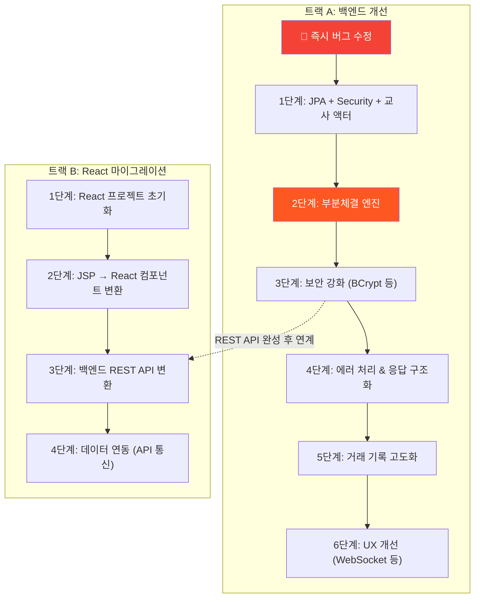

# 📌 stockGame_spring — 앞으로 해야 할 일 종합 정리

> 4개 문서([project_summary.md](file:///d:/skmfmfvlrm/java_project/stockGame_spring/project_summary.md), [implementation_plan.md](file:///d:/skmfmfvlrm/java_project/stockGame_spring/implementation_plan.md), [react_migration_plan.md](file:///d:/skmfmfvlrm/java_project/stockGame_spring/react_migration_plan.md), [react_migration_tasks.md](file:///d:/skmfmfvlrm/java_project/stockGame_spring/react_migration_tasks.md))를 종합 분석한 결과입니다.

---

## 현재 프로젝트 상태 요약

| 항목 | 상태 |
|---|---|
| **프로젝트** | 학생 대상 주식 모의투자 시뮬레이션 (Spring Boot 3.5 + MyBatis + JSP) |
| **핵심 기능** | 주식 매수/매도, 주문 매칭, 쿠폰 상점, 자산 대시보드, 뉴스 |
| **프론트엔드** | JSP 13개 페이지 → React SPA 마이그레이션 **진행 중** |
| **백엔드 개선** | 6단계 로드맵 수립 완료, **미착수** |
| **알려진 버그** | 2건 (cancelOrder 환불 미작동, 세션 검증 무의미) |

---

## 🔴 즉시 수정 필요 (버그 — 1~2시간)

코드 로직 오류이므로 다른 작업 전에 먼저 해결해야 합니다.

### 1. `cancelOrder` 매수 취소 시 포인트 환불 미작동
- **파일**: [StockOrderServiceImpl.java](file:///d:/skmfmfvlrm/java_project/stockGame_spring/src/main/java/com/skfkfkvlrm/stockgame_spring/service/impl/StockOrderServiceImpl.java)
- **원인**: `"BUY".equals(order.getContent())` → `OrderStatus` enum이 한국어(`매수`)이므로 항상 `false`
- **영향**: 매수 대기 주문을 취소해도 포인트가 돌아오지 않음
- **수정**: `OrderStatus.매수.name().equals(order.getContent())`로 변경

### 2. `StockOrderController` 세션 검증이 사실상 무의미
- **파일**: [StockOrderController.java](file:///d:/skmfmfvlrm/java_project/stockGame_spring/src/main/java/com/skfkfkvlrm/stockgame_spring/controller/StockOrderController.java)
- **원인**: `session.setAttribute("studentId", ...)` 직후 `session.getAttribute("studentId") == null` 체크 → 항상 non-null
- **영향**: 비로그인 사용자도 주문 가능 (로그인 검증 무력화)
- **수정**: `setAttribute` 전에 검증하거나, `@SessionAttribute` 어노테이션으로 전환

---

## 진행해야 할 작업 — 두 트랙

현재 프로젝트에는 **백엔드 개선**과 **프론트엔드 React 마이그레이션** 두 갈래의 작업이 있습니다.



---

## 트랙 A: 백엔드 개선 (6단계 로드맵)

### 1단계: JPA + Spring Security + 교사(Teacher) 액터 도입 `[ ]`

> 기존 학생 MyBatis는 유지, JPA는 Security/교사 도메인에만 적용

| 작업 | 상태 | 비고 |
|---|---|---|
| `Teacher.java` JPA 엔티티 생성 | `[ ]` | username, password(BCrypt), name, subject, role |
| `Role.java` Enum 생성 | `[ ]` | ROLE_STUDENT, ROLE_TEACHER |
| `TeacherRepository.java` 생성 | `[ ]` | Spring Data JPA |
| `SecurityConfig.java` 생성 | `[ ]` | 교사 `/admin/**`만 Security 적용, 학생 경로는 permitAll |
| `CustomUserDetailsService.java` 생성 | `[ ]` | Security UserDetailsService |
| `TeacherService.java` 생성 | `[ ]` | 교사 비즈니스 로직 |
| `AdminController.java` 생성 | `[ ]` | 교사 관리 페이지 (대시보드, 종목/학생/뉴스/쿠폰/거래 관리) |
| `AdminApiController.java` 생성 | `[ ]` | 교사 REST API |
| `application.yaml` 수정 | `[ ]` | Security 설정 추가 |

---

### 2단계: 부분체결(Partial Fill) 엔진 완성 `[ ]`

> [!CAUTION]
> **현재 가장 큰 기능 결함.** 수량이 정확히 일치하는 주문만 매칭되므로 실사용 시 대부분의 주문이 영구 대기 상태에 빠짐.

| 작업 | 상태 | 비고 |
|---|---|---|
| `Order` 엔티티에 `filledAmount` 필드 추가 | `[ ]` | 체결된 수량 추적 |
| `OrderStatus`에 `부분체결` 추가 | `[ ]` | 대기/부분체결/체결/취소 |
| `Transaction` 엔티티에 `amount`, `price` 필드 추가 | `[ ]` | 체결 수량·가격 기록 |
| DDL 변경 (ALTER TABLE) | `[ ]` | `filled_amount`, `amount`, `price` 컬럼 |
| `getMatchOrder` 쿼리 수정 | `[ ]` | `amount = #{}` 조건 제거, 잔량 > 0 조건 + 복수 건 조회 |
| `StockOrderServiceImpl` 매칭 로직 전면 개편 | `[ ]` | 반복 매칭 + 부분체결 처리 |
| `cancelOrder` 환불 로직 수정 | `[ ]` | 부분체결된 수량 제외 후 잔량만 환불 |
| 보유 수량 계산에 `filled_amount` 반영 | `[ ]` | `myAssetMapper.xml` 수정 |

---

### 3단계: 보안 강화 `[x]`

| 작업 | 상태 | 우선순위 |
|---|---|---|
| 비밀번호 BCrypt 해싱 적용 | `[x]` | 🔴 높음 |
| 학생 인증을 Spring Security로 점진 통합 | `[x]` | 🟡 중간 |
| 세션 검증 로직 정상화 | `[x]` | 🟡 중간 |
| 교사 관리 페이지에 CSRF 적용 | `[x]` | 🟢 낮음 |

---

### 4단계: 에러 처리 & 응답 구조화 `[ ]`

| 작업 | 상태 |
|---|---|
| `ApiResponse<T>` 통합 응답 객체 생성 | `[ ]` |
| 커스텀 예외 클래스 생성 (InsufficientPoint, OrderNotFound 등) | `[ ]` |
| `@RestControllerAdvice` 글로벌 예외 핸들러 생성 | `[ ]` |
| 서비스 계층 String 반환 → 예외 throw 방식으로 리팩터링 | `[ ]` |

---

### 5단계: 거래 기록 고도화 `[ ]`

| 작업 | 상태 |
|---|---|
| 가격 히스토리 테이블 생성 (종목별 시간대별 가격 변동) | `[ ]` |
| 일별 종가 저장 (open, high, low, close, volume) | `[ ]` |
| 거래량 집계 (일별/시간별) | `[ ]` |
| 수익률 랭킹 (교사 대시보드) | `[ ]` |
| `prev_price` 자동 갱신 스케줄러 (`@Scheduled`) | `[ ]` |

---

### 6단계: UX & 추가 기능 `[ ]`

| 작업 | 상태 |
|---|---|
| WebSocket(STOMP) 실시간 호가창 | `[ ]` |
| 주문 확인 다이얼로그 (매수/매도 전 확인) | `[ ]` |
| 호가 단위 제한 (가격대별) | `[ ]` |
| 일일 거래 한도 (교사 설정) | `[ ]` |
| 시장 영업시간 (교사 제어) | `[ ]` |
| 캔들스틱/라인 차트 시각화 | `[ ]` |
| 체결 알림 시스템 (SSE/WebSocket) | `[ ]` |

---

## 트랙 B: React SPA 마이그레이션

### 1단계: React 프로젝트 초기화 `[/]` (진행 중)

| 작업 | 상태 | 비고 |
|---|---|---|
| Vite + React 프로젝트 생성 | `[ ]` | Node.js 설치 필요 |
| `react-router-dom`, `axios` 설치 | `[ ]` | |
| `App.jsx` 기본 라우팅 구조 설정 | `[x]` | 가이드 코드 작성 완료 |

### 2단계: JSP → React 컴포넌트 변환 `[/]` (진행 중)

| 작업 | 상태 | 비고 |
|---|---|---|
| `SideBar.jsp` → `<Sidebar />` | `[x]` | 가이드 코드 완료 |
| `StockList.jsp` → `<StockList />` | `[x]` | 가이드 코드 완료 |
| `Login.jsp` → `<Login />` | `[x]` | 가이드 코드 완료 |
| `StockDetail.jsp` → `<StockDetail />` | `[ ]` | |
| `AddMember.jsp` → `<AddMember />` | `[ ]` | |
| `MyAssets.jsp` → `<MyAssets />` | `[ ]` | |
| 나머지 JSP 페이지들 변환 | `[ ]` | CouponMarket, News, PointHistory 등 |
| 기존 CSS 파일 연동 | `[ ]` | |

### 3단계: 백엔드 REST API 변환 `[ ]`

| 작업 | 상태 |
|---|---|
| 프론트엔드에서 필요한 REST 엔드포인트 파악 | `[ ]` |
| `@Controller` → `@RestController` 변환 | `[ ]` |
| Spring Boot CORS 설정 추가 | `[ ]` |

### 4단계: 데이터 연동 `[ ]`

| 작업 | 상태 |
|---|---|
| `useEffect` + `axios`로 API Fetch 로직 구현 | `[ ]` |
| 받아온 데이터를 React State에 바인딩 | `[ ]` |

---

## 미결정 사항 (결정 필요)

React 마이그레이션을 본격 진행하기 전에 결정이 필요한 항목들:

| # | 질문 | 선택지 |
|---|---|---|
| 1 | **React 프로젝트 도구** | Vite (권장) vs Create React App |
| 2 | **상태 관리** | React Hooks + Context API vs Redux vs Zustand |
| 3 | **스타일링** | 기존 CSS 유지 vs CSS Modules vs Styled Components vs Tailwind |
| 4 | **작업 진행 순서** | 백엔드 개선 먼저? React 마이그레이션 먼저? 병렬 진행? |

---

## 추천 진행 순서

> [!IMPORTANT]
> 두 트랙을 완전 병렬로 진행하면 REST API 변환 시점에서 충돌이 생깁니다. 아래 순서를 권장합니다.

```
1. 🔴 즉시 버그 수정 (cancelOrder 환불 + 세션 검증)
    ↓
2. 백엔드 3단계까지 (JPA/Security → 부분체결 → 보안)
    ↓  ← 백엔드 API가 안정화된 시점
3. React 마이그레이션 시작 (1~2단계: 프로젝트 생성 + 정적 변환)
    ↓
4. 백엔드 4단계 (에러 처리 + API 응답 구조화) + React 3단계 (REST 변환) 동시 진행
    ↓
5. React 4단계 (데이터 연동)
    ↓
6. 백엔드 5~6단계 (거래 고도화 + UX) — React와 함께 점진 개선
```

이 순서를 따르면 API 스펙이 확정된 상태에서 프론트엔드를 연결하게 되어 **재작업을 최소화**할 수 있습니다.
